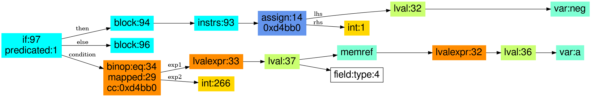
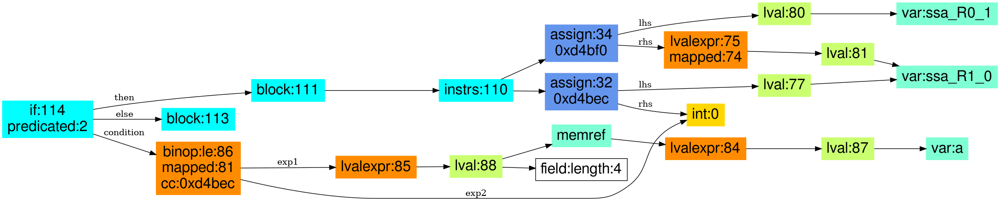

## Libcrypto: crypto/asn1/a_enum.c: ASN1_ENUMERATED_get

### Predicated: 1

#### source code fragment:

```
	i=a->type;
	if (i == V_ASN1_NEG_ENUMERATED)
		neg=1;
```

#### CodeHawk annotated assembly of basic block:

```
   0xd4ba4  LDR     R2, [R0,#0x4]   R2 := R0_in[4]_in (C: __pderef_R0_in.type_in)
   0xd4ba8  LDR     R3, 0xd4c2c     R3 := 0x10a (C: 0x10a) (addr: 0xd4c2c; C: 0xd4c2c)
   0xd4bac  CMP     R2, R3          compare R2 and R3 ((R0_in[4]_in - 0x10a)) (C: (__pderef_R0_in.type_in - 0x10a))
   0xd4bb0  MOVEQ   R4, #1          if (R0_in[4]_in == 0x10a)(C: (__pderef_R0_in.type_in == 0x10a)) then R4 := 0x1 (C: 0x1)
   0xd4bb4  BEQ     0xd4bd0         if (__pderef_R0_in.type_in == 0x10a) then goto 0xd4bd0
```

#### CodeHawk lifting:

    if ((a->type == 266)) {
      neg = 1; // 0xd4bb0, MOV
    } // if 


#### High-level PIR for if statement:

The if-statement node is annotated with the property predicated:1, indicating that this
if statement was created for a single predicated instruction, and both the single
instruction in the then block and the condition have associated address 0x4bb0.




### Predicated: 2

The same function also contains an example of the combination of two consecutive
predicated instructions representing the source code fragment:

#### source code fragment


