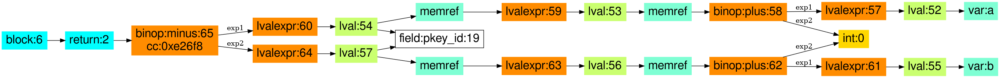
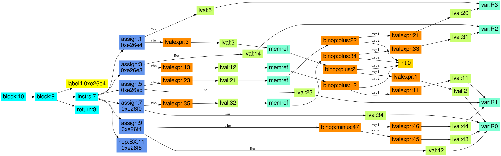

## Libcrypto: crypto/asn1/ameth_lib.c: ameth_cmp

#### source code:

```
static int ameth_cmp(const EVP_PKEY_ASN1_METHOD * const *a,
		     const EVP_PKEY_ASN1_METHOD * const *b)
	{
        return ((*a)->pkey_id - (*b)->pkey_id);
	}
```

#### CodeHawk annotated assembly:

```
int (struct evp_pkey_asn1_method_st * * a, struct evp_pkey_asn1_method_st * * b)

--------------------------------------------------------------------------------
   0xe26e4  LDR   R3, [R0]     R3 := R0_in[0]_in (C: __pderef_R0_in[<[0]>]_in) (addr: a; C: a)
   0xe26e8  LDR   R2, [R1]     R2 := R1_in[0]_in (C: __pderef_R1_in[<[0]>]_in) (addr: b; C: b)
   0xe26ec  LDR   R1, [R3]     R1 := R0_in[0]_in[0]_in (C: __pderef___pderef_R0_in[<[0]>]_in.pkey_id_in)
   0xe26f0  LDR   R0, [R2]     R0 := R1_in[0]_in[0]_in (C: __pderef___pderef_R1_in[<[0]>]_in.pkey_id_in)
   0xe26f4  RSB   R0, R0, R1   R0 := (R1 - R0) (= (R0_in[0]_in[0]_in - R1_in[0]_in[0]_in)) (C: (__pderef___pderef_R0_in[<[0]>]_in.pkey_id_in - __pderef___pderef_R1_in[<[0]>]_in.pkey_id_in))
   0xe26f8  BX    LR           return (R0_in[0]_in[0]_in - R1_in[0]_in[0]_in) (C: (__pderef___pderef_R0_in[<[0]>]_in.pkey_id_in - __pderef___pderef_R1_in[<[0]>]_in.pkey_id_in))
--------------------------------------------------------------------------------
```

#### CodeHawk lifting:

```
int ameth_cmp(struct evp_pkey_asn1_method_st * * a, struct evp_pkey_asn1_method_st * * b) {

  return (a[0]->pkey_id - b[0]->pkey_id);
}
```

#### High-level PIR

The high-level PIR has, like the original source code, just one statement, the
return statement, with a return expression. The lval-expressions in the return
expressions are connected to the instructions that define them via the
reaching definitions.




#### Low-level PIR

The low-level PIR includes the full control-flow graph with all its instructions,
without any high-level control flow constructs.

