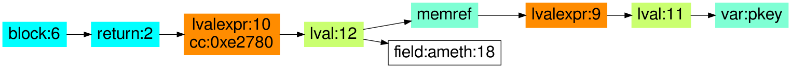
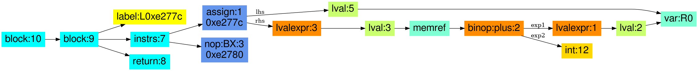

## Libcrypto: crypto/asn1/ameth_lib.c: EVP_PKEY_get0_asn1 

#### source code

```
const EVP_PKEY_ASN1_METHOD* EVP_PKEY_get0_asn1(EVP_PKEY *pkey)
	{
	return pkey->ameth;
	}
```


#### CodeHawk annotated assembly:

```
struct evp_pkey_asn1_method_st * (struct evp_pkey_st * pkey)

--------------------------------------------------------------------------------
   0xe277c  LDR   R0, [R0,#0xc]   R0 := R0_in[12]_in (C: __pderef_R0_in.ameth_in)
   0xe2780  BX    LR              return R0_in[12]_in (C: __pderef_R0_in.ameth_in)
--------------------------------------------------------------------------------
```

#### CodeHawk lifting:

```
struct evp_pkey_asn1_method_st * EVP_PKEY_get0_asn1(struct evp_pkey_st * pkey) {

  return pkey->ameth;
}
```

#### High-level PIR




#### Low-level PIR

