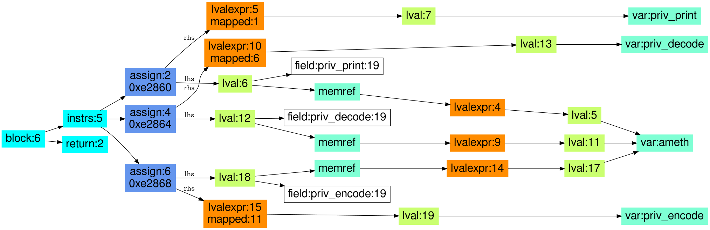

## Libcrypto: crypto/asn1/ameth_lib.c: EVP_PKEY_ans1_set_private

#### source code

```
void EVP_PKEY_asn1_set_private(EVP_PKEY_ASN1_METHOD *ameth,
		int (*priv_decode)(EVP_PKEY *pk, PKCS8_PRIV_KEY_INFO *p8inf),
		int (*priv_encode)(PKCS8_PRIV_KEY_INFO *p8, const EVP_PKEY *pk),
		int (*priv_print)(BIO *out, const EVP_PKEY *pkey, int indent,
							ASN1_PCTX *pctx))
	{
	ameth->priv_decode = priv_decode;
	ameth->priv_encode = priv_encode;
	ameth->priv_print = priv_print;
	}
```

#### CodeHawk annotated assembly code

```
void (struct evp_pkey_asn1_method_st * ameth, int__(struct pkcs8_priv_key_info_st * p8inf, struct evp_pkey_st * pk) * priv_decode, int__(struct evp_pkey_st * pk, struct pkcs8_priv_key_info_st * p8) * priv_encode, int__(struct asn1_pctx_st * pctx, int indent, struct evp_pkey_st * pkey, struct bio_st * out) * priv_print)

--------------------------------------------------------------------------------
   0xe2860  STR    R3, [R0,#0x2c]  R0_in[44] := priv_print (C: __pderef_R0_in.priv_print := priv_print)
   0xe2864  STR    R1, [R0,#0x24]  R0_in[36] := priv_decode (C: __pderef_R0_in.priv_decode := priv_decode)
   0xe2868  STR    R2, [R0,#0x28]  R0_in[40] := priv_encode (C: __pderef_R0_in.priv_encode := priv_encode)
   0xe286c  BX     LR              return ameth (C: ameth)
--------------------------------------------------------------------------------
```

#### CodeHawk lifting

```
void EVP_PKEY_asn1_set_private(struct evp_pkey_asn1_method_st * ameth,
     int (*priv_decode)(struct evp_pkey_st * pk, struct pkcs8_priv_key_info_st * p8inf),
     int (*priv_encode)(struct pkcs8_priv_key_info_st * p8, struct evp_pkey_st * pk),
     int (*priv_print)(struct bio_st * out, struct evp_pkey_st * pkey,
     int indent, struct asn1_pctx_st * pctx)) {

  ameth->priv_print = priv_print; // 0xe2860, STR
  ameth->priv_decode = priv_decode; // 0xe2864, STR
  ameth->priv_encode = priv_encode; // 0xe2868, STR
  return;
}

```

#### High-level PIR




#### Low-level PIR

