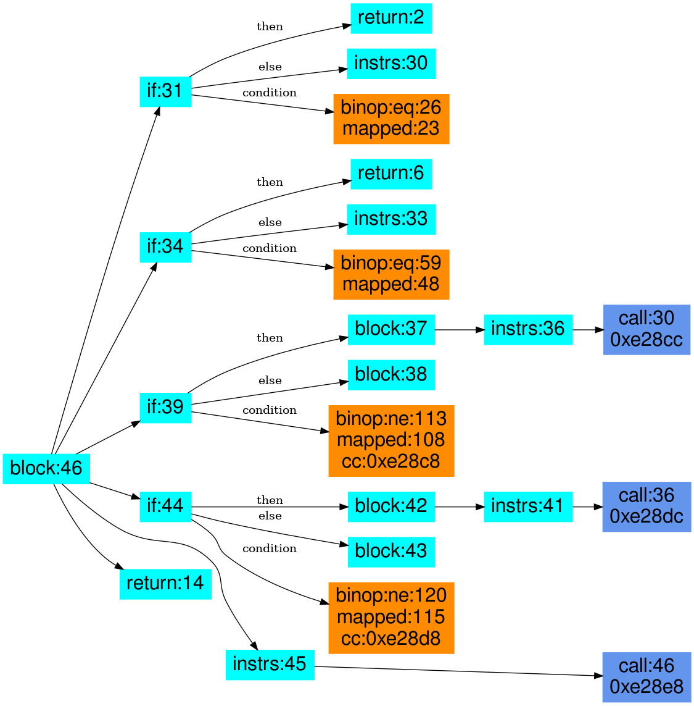

## Libcrypto: crypto/asn1/ameth_lib.c: EVP_PKEY_asn1_free

#### source code

```
void EVP_PKEY_asn1_free(EVP_PKEY_ASN1_METHOD *ameth)
	{
	if (ameth && (ameth->pkey_flags & ASN1_PKEY_DYNAMIC))
		{
		if (ameth->pem_str)
			OPENSSL_free(ameth->pem_str);
		if (ameth->info)
			OPENSSL_free(ameth->info);
		OPENSSL_free(ameth);
		}
	}
```

#### CodeHawk annotated assembly:

```
void (struct evp_pkey_asn1_method_st * ameth)

--------------------------------------------------------------------------------
   0xe28a8  PUSH      {R4,LR}        SP := (SP_in - 0x8); var_0008 := R4_in; var_0004 := LR_in
   0xe28ac  SUBS      R4, R0, #0     R4 := (R0 - 0x0) (= ameth) (C: ameth)
   0xe28b0  POPEQ     {R4,PC}        if (ameth == 0x0)(C: (ameth == 0x0)) then SP := SP_in; R4 := R4_in; PC := LR_in; return 0x0 (C: 0x0)
--------------------------------------------------------------------------------
   0xe28b4  LDR       R3, [R4,#0x8]  R3 := R0_in[8]_in (C: __pderef_R0_in.pkey_flags_in) 
   0xe28b8  TST       R3, #2         compare 0x2 and R3 ((R3 & 0x2))
   0xe28bc  POPEQ     {R4,PC}        if ((R0_in[8]_in & 0x2) == 0x0)(C: ((__pderef_R0_in.pkey_flags_in & 0x2) == 0x0)) then SP := SP_in; R4 := R4_in; PC := LR_in; return ameth (C: ameth)
--------------------------------------------------------------------------------
   0xe28c0  LDR       R0, [R4,#0xc]   R0 := R0_in[12]_in (C: __pderef_R0_in.pem_str_in)
   0xe28c4  CMP       R0, #0          compare R0 and 0x0 (R0_in[12]_in) (C: __pderef_R0_in.pem_str_in)
   0xe28c8  BEQ       0xe28d0         if (__pderef_R0_in.pem_str_in == 0x0) then goto 0xe28d0
--------------------------------------------------------------------------------
   0xe28cc  BL        0x3be80         call CRYPTO_free(R0_in[12]_in) (C: (__pderef_R0_in.pem_str_in))
--------------------------------------------------------------------------------
   0xe28d0  LDR       R0, [R4,#0x10]  R0 := R0_in[16]_in (C: __pderef_R0_in.info_in)
   0xe28d4  CMP       R0, #0          compare R0 and 0x0 (R0_in[16]_in) (C: __pderef_R0_in.info_in)
   0xe28d8  BEQ       0xe28e0         if (__pderef_R0_in.info_in == 0x0) then goto 0xe28e0
--------------------------------------------------------------------------------
   0xe28dc  BL        0x3be80         call CRYPTO_free(R0_in[16]_in) (C: (__pderef_R0_in.info_in))
--------------------------------------------------------------------------------
   0xe28e0  MOV       R0, R4          R0 := ameth (C: ameth)
   0xe28e4  POP       {R4,LR}         SP := SP_in; R4 := R4_in; LR := LR_in
   0xe28e8  B         0x3be80         call CRYPTO_free(ameth) (C: (ameth))
--------------------------------------------------------------------------------
```

#### CodeHawk lifting:

```
void EVP_PKEY_asn1_free(struct evp_pkey_asn1_method_st * ameth) {

  if ((ameth == 0)) {
    return;
  } // if 
  if (((ameth->pkey_flags & 2) == 0)) {
    return;
  } // if 
  if ((ameth->pem_str != 0)) {
    CRYPTO_free(ameth->pem_str); // 0xe28cc, BL
  } // if 
  if ((ameth->info != 0)) {
    CRYPTO_free(ameth->info); // 0xe28dc, BL
  } // if 
  CRYPTO_free(ameth); // 0xe28e8, BL
  return;
}
```

#### High-level PIR

The PIR visualization below shows the four if statements contained in
this function (only the statement/instruction skeleton is shown here
to keep the size of the graph manageable). The first two if statements
originate from a predicated instruction (they currently do not have
a reference to the 'branch' instruction). The last two if statements
are regular branches constructed from conditional jumps.

